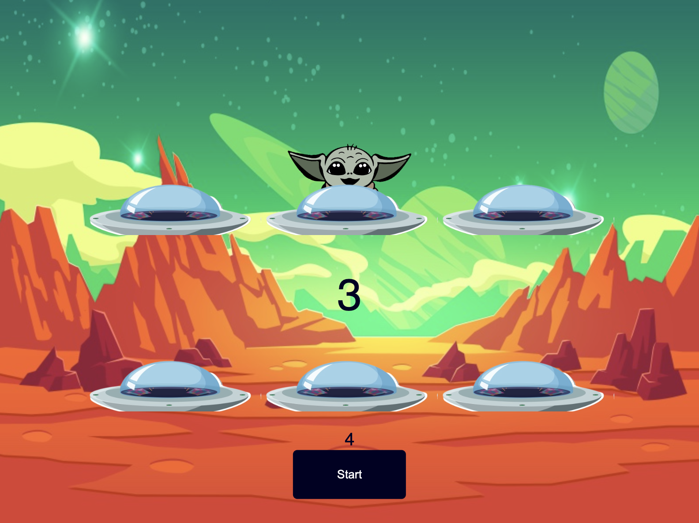

# Alien Game

## Description

Alien Game is a simple web-based whack-a-mole game where players aim to hit appearing aliens (represented by Yoda) to score points. The objective is to achieve a score higher than 10 within a time limit to save the planet.

## Features

- Hit aliens to score points.
- Limited time to achieve a score of 10 or higher.
- Interactive gameplay with animations and sounds.
- Responsive design for different screen sizes.

## Screenshots



## Requirements

- Modern web browser with JavaScript enabled.

## Preview
- Go to the game website and play!
- https://alien-game.pages.dev

## Installation

1. Clone the repository or download the source code.

    ```sh
    git clone https://github.com/ShehanCodes/alien-game.git
    ```

2. Open `index.html` in a web browser to play the game.

## Usage

1. Click the "Start" button to begin the game.
2. Hit appearing aliens (Yoda) to score points.
3. Achieve a score of 10 or higher within the time limit to save the planet.

## Customization

- You can adjust the time limit and scoring threshold by modifying the `timeLimit` and `score > 10` conditions in the JavaScript code.

## Contributing

Feel free to submit issues or pull requests if you find bugs or have improvements.

## License

This project is licensed under the MIT License.

## Credits

- Yoda images sourced from [Star Wars: The Force Unleashed](https://starwars.fandom.com/wiki/Star_Wars:_The_Force_Unleashed) video game.
- Sounds and animations adapted from various online resources.
